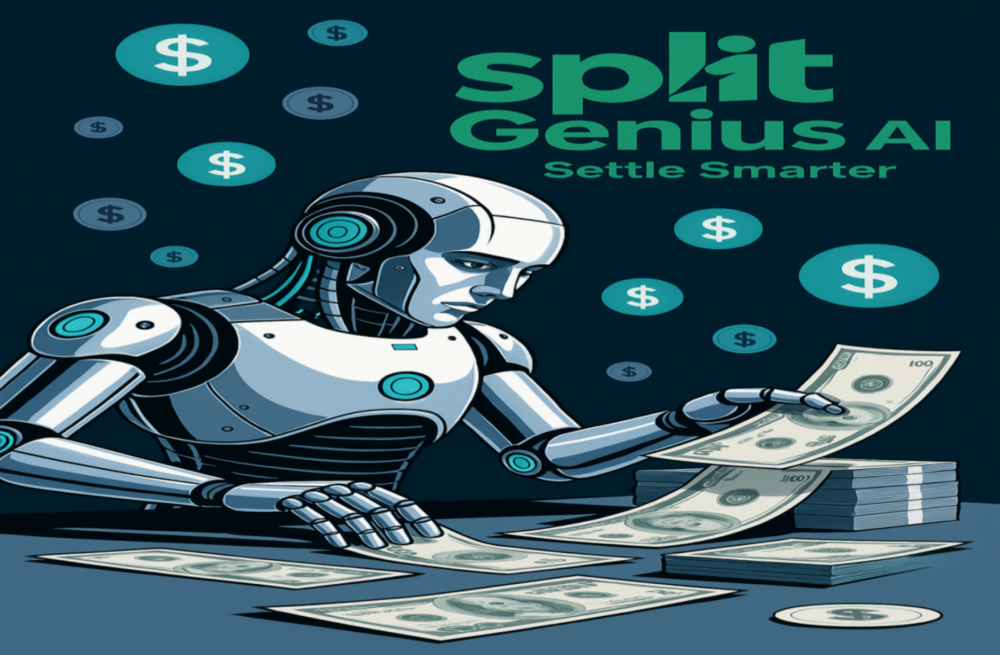

# 💰 SplitGenius AI

> 💡 **Smart Expense Splitting Made Simple**

## 🌟 Introduction
SplitGenius AI revolutionizes expense sharing with cutting-edge artificial intelligence. Say goodbye to complex calculations and awkward money conversations! Our platform makes splitting expenses with friends, roommates, or any group feel like magic. ✨

### 🎯 Why Choose SplitGenius AI?
- 🤖 **AI-Powered Calculations** - Smart and accurate expense distribution
- ⚡ **Real-time Updates** - Instant synchronization across all devices
- 🔒 **Secure Transactions** - Bank-level security for your peace of mind
- 🎨 **Beautiful Interface** - Intuitive design that makes expense management a breeze

## 🛠️ Tech Stack

### 🎨 Frontend
- 🚀 **Next.js 13+**
- 💅 **Tailwind CSS**
- 🔐 **Clerk**
- 🎯 **Radix UI**
- 🔔 **Sonner**

### ⚙️ Backend
- 🔄 **Convex**
- ⚡ **Inngest**
- ⏰ **Reminders**
- 📊 **Analytics**
- 📧 **Notifications**

### 🔧 Development
- 📝 **TypeScript**
- 🔍 **ESLint**
- 🎨 **PostCSS**
- 📦 **npm**
- 🔄 **Git**

## ✨ Features

### 👥 User Management
- 🔐 Secure auth
- 👤 User profiles
- 📇 Contacts
- 🔑 2FA support

### 💰 Expense Management
- 📝 Easy tracking
- 🏷️ Categories
- 🔄 Real-time sync
- 📸 Receipts

### 👥 Group Management
- 🤝 Multiple groups
- ➕ Add members
- 📊 Track expenses
- 💹 Balance view

### 🤖 Smart Settlements
- 🧠 AI suggestions
- 📉 Debt reduction
- 💳 Payment options
- 📋 Track history

### 📊 Analytics
- 📈 Personal insights
- 📊 Group analysis
- 📜 History logs
- 📉 Trends view

### 🔔 Notifications
- ⏰ Reminders
- 📱 Push alerts
- 📧 Email updates
- 🔔 Activity feed

## 📱 Screenshots

## 🤝 Contributing

We welcome contributions! Please feel free to submit a Pull Request.

## 📝 License

This project is licensed under the MIT License - see the [LICENSE](LICENSE) file for details.

## 💖 Support

If you like this project, please give it a ⭐️!

---

Made with ❤️ by the SplitGenius Team

        
